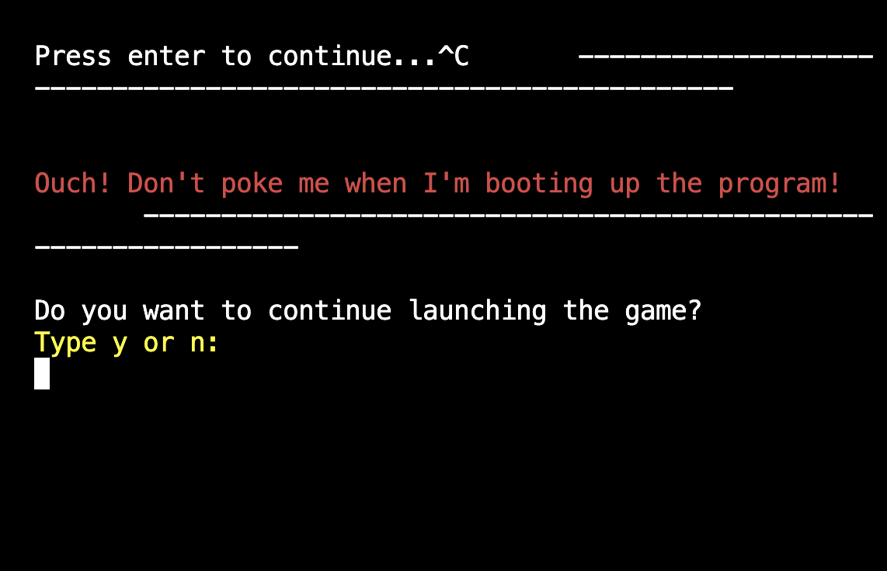
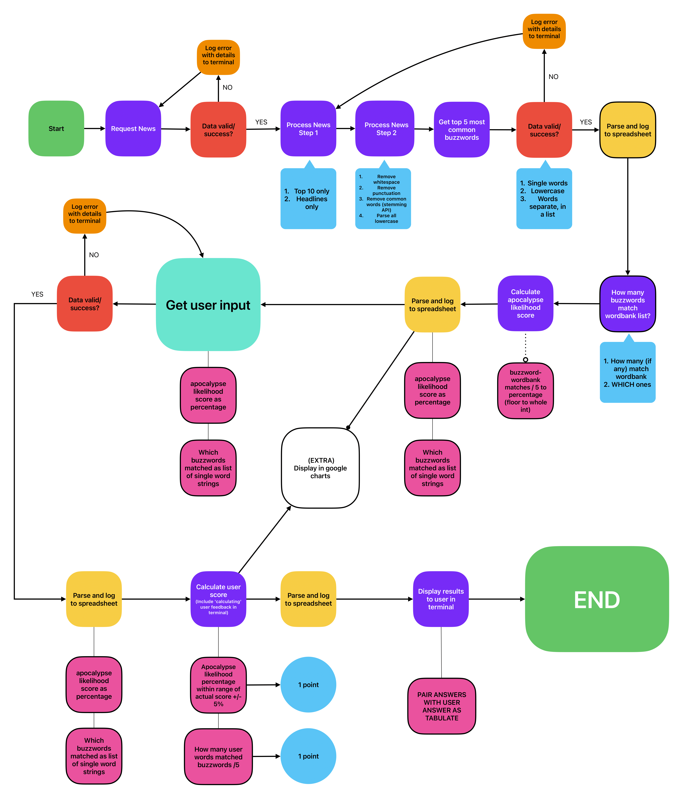

---
# [ZOMBIE BINGO](https://zombie-bingo-a26c47d43c24.herokuapp.com)

### Zombie Bingo 🧟‍♂️: A Thrilling Apocalypse Anticipation Game!
"Welcome to Zombie Bingo 🧟‍♂️, where doomsday joins your news feed! Picture this: a thrilling blend of current events and apocalyptic anticipation in a scintillating yet simple game package in your terminal. The app scours the latest headlines for key words, and your mission, should you choose to accept it, is to guess them right, alongside guessing how likely doomsday is today. Each correct guess earns you a point, but here's the twist: the more buzzwords you nail, the closer you get to determining the likelihood of the apocalypse—on a scale of 0 to 100. It's a race against time, wits, and the impending doom ahead. Are you ready to bingo your way through the apocalypse?"

The target audience for Zombie Bingo includes:

1. **Game Enthusiasts**: Individuals with terminal access who enjoy engaging and unique gaming experiences, especially those with a twist or unconventional theme.

2. **Culture Fans**: People interested in the news, apocalyptic scenarios, and contemporary headline references.

3. **News Junkies**: Those who stay updated with current events and enjoy incorporating them into their entertainment.

4. **Trivia and Word Game Enthusiasts**: Fans of trivia and word games who enjoy challenges and testing their knowledge.

5. **Tech-Savvy Users**: Individuals comfortable with using the terminal on their respective devices, even if just for silly entertainment purposes.

6. **Age Range**: While Zombie Bingo can appeal to a broad age range, it may particularly attract younger adults and those with a penchant for humor, coding and creativity.

Zombie Bingo 🧟‍♂️ offers a humorous, succinct gaming experience by blending current events with apocalyptic anticipation. By guessing key words sourced from news headlines, players earn points and gauge the likelihood of an impending apocalypse, adding an exciting twist of actually being based on real life headlines gathered freshly each time the game is run. This game is perfect for pessimists, game enthusiasts seeking something offbeat, contemporary culture fans intrigued by apocalyptic scenarios, news junkies looking to merge current events with entertainment, trivia and word game players eager for challenges, and tech-savvy users seeking something silly and fun as a digital experience. Whether you're craving a dose of fun, a challenge for your brain, or simply a quick break from the mundane, Zombie Bingo promises to deliver an entertaining and memorable, brief experience for all.

## UX

## Features

<!-- 

explain what value each of the features 
focusing on who this website is for,
what it is that they want to achieve,
how your project is the best way to help achieve these things.

reference the specific project files that implement them.

!-->

### Existing Features

- **News Headlines API**

    - Gathers top news headlines fresh each time the API is called. These headlines are real and broad-ranging offering a gaming experience completely based on real, tangible headlines from across the world, perfect for target audiences including the news junkies! Only the top headlines are offered, meaning that no matter who plays, the headlines are almost guaranteed to be relevant in some way to each user, regardless of background or country. 
<!-- TODO ADD SCREENSHOT -->



- **Google Sheets API**

    - For the more data-oriented news junkies, or more hard-core players, each time the game is played, answers from both the program (including top keywords from the headlines and the calculated likelihood of apocalypse) and the user. Users can look at their scores overtime and also look back at old faux-pas to learning better strategies for next games! Users can check their answers, scores and the program's answers any time to improve and learn more about the headlines in the real life news as they play.
<!-- TODO ADD SCREENSHOT -->


- **User Input via Terminal**

    - The game is played entirely via the terminal as a self-contained app, perfect for the technically-minded of our target audiences. Users answer questions directly typing into the terminal, with results printed and fed back to the user all within the terminal interface. This is therefore very lightweight taking up almost zero storage space, whilst also being easy to read. Users are kept up to date with the program as it runs, what it's doing and when it is loading to ensure a seamless, clean and self-contained experience for ease of use and a positive UX.
<!-- TODO ADD SCREENSHOT -->


- **User Feedback**

    - Any errors, either from the program or issues with user answers not being valid are returned directly in the terminal to the user for a seamless gaming experience with quick feedback on what is incorrect to fix for another try. This way, the program will also not break and the user can keep playing as many times as they like. (It can get quite addictive, as it's a quick game if you want it to be!).
<!-- TODO ADD SCREENSHOT -->


- **Game Restart**

    - At the end of the game, the user is prompted to restart the game or finished the game. Any previous data and text within the terminal will be cleared. A fresh batch of news headlines will be pulled and the game begins seamlessly again, meaning our hardcore news junkies can play as many times as they wish to their heart's content. Something just happened in the news? The game is totally fresh as the API pulls the very latest news headlines from the real world! Make the real life news your game!
<!-- TODO ADD SCREENSHOT -->


- **Game Answers**

    - After the user has answered both main questions, the game provides the game answers alongside the user's answers, with an apocalypse probability based on the current headlines and their respective buzzwords. This will help all our users, whether brand new or very experienced players of the game to keep in touch with the latest keywords from top news articles across the world. 
<!-- TODO ADD SCREENSHOT -->


- **Average Score**

    - Players who have played the game at least once in the past will receive an average score back in the terminal at the end of the game, before being asked to play again. Perfectionists like me I'm sure will want to press that 'yes I'll play again button'... there are scores to improve!
    This will keep each user fully engaged in trying to improve and try the game again. The game is much more than just the game, it's about the user's awareness of contemporary events, or a fun way to let off steam channelling your inner pessimism...! The world isn't always bright and shiny, so we may as well have some fun despite the hard times. 
<!-- TODO ADD SCREENSHOT -->


- **Colors and Visuals!**

    - Yes, it's a terminal game. But that doesn't mean we have to stick to a black and white screen. Thanks to the text2art and colorama libraries, this terminal just got a bit more fun (not to mention for those of you, like me, who have visual stress and dyslexia, it's a bit easier to read...!). The game is here for everyone to enjoy and the colors and visuals add a touch of chilli to your con carne... 
<!-- TODO ADD SCREENSHOT -->


### Future Features

- Optional headline filtering via terminal
    - The user could add optional filters of criteria for the news API to use, including which country the program sources headlines from, or the number of results. This will bring an even further number of filtered results to keep the game interesting. Players could then test their world events knowledge based on headlines for specific countries and improve their performance!
- Add further word bank entries
    - Users could add additional key words they think are relevant over time to impending doom, to refine the game further, especially if some words become more common over time due to media trends.
- Analytics and interpretation
    - At the end of each week, users may receive insights on their average point scores based on different data points over time: such as what times of day they generally scored the best scores and when they really flopped... The data can be represented in fun and visual ways with google charts or other fun and colorful graphics to make it even more engaging for our data-junkies and perfectionists alike.
- Add sound effects when results are printed
    - At the end of each game, a sound is played to add additional user feedback for improved UX. This was not possible at the current time of deployment due to issues with static file handling in Heroku. I hope to find a workaround for this to provide user feedback and interactivity that supports the silly and simple themes this game has to offer for an even more engaging experience during gameplay. Sound effects can change depending on whether scores are good or bad, whether the chance of apocalypse according to the program is greater or smaller. Cue impending doom music...
- If no input is provided then the program will sleep after 2 minutes.
    - This would be useful for power saving at the end of the game or where any user input is required and none is given within the two minutes.

## Tools & Technologies Used

<!-- TODO UPDATE LINKS -->
- [Python](https://www.python.org) used as the back-end programming language.
- [Git](https://git-scm.com) used for version control. (`git add`, `git commit`, `git push`)
- [GitHub](https://github.com) used for secure online code storage.
- [Heroku](https://www.heroku.com) used for hosting the deployed back-end site.
- [Gspread](https://www.google.com...) used for...
- [Google Sheets](https://www.google.com...), used for...
- [NewsNowAPI](https://rapidapi.com/rphrp1985/api/newsnow), used for gathering a list of contemporary headlines from top news sites.
- [Google Cloud](https://www.google.com...), used for...


## Data Model

### Flowchart

To follow best practice, a flowchart was created for the app's logic,
and mapped out before coding began using
[Freeform](https://www.apple.com/uk/newsroom/2022/12/apple-launches-freeform-a-powerful-new-app-designed-for-creative-collaboration/).

Below is the flowchart of the main process of this Python program. It shows the entire cycle of the program.



### Classes & Functions

<!-- The program uses classes as a blueprint for the project's objects (OOP). This allows for the object to be reusable.

```python
class Person:
    """ Insert docstring comments here """
    def __init__(self, name, age, health, inventory):
        self.name = name
        self.age = age
        self.health = health
        self.inventory = inventory
``` -->

The primary functions used on this application are: 
<!-- UPDATE THIS FURTHER -->

- `get_headlines()`
    <!-- - Get sales figures input from the user. -->
- `process_data()`
    <!-- - Converts all string values into integers. -->
- `remove_common_words()`
    <!-- - Update the relevant worksheet with the data provided. -->
- `percentage_of_wordbank_matches()`
    <!-- - Compare sales with stock and calculate the surplus for each item type. -->
- `get_wordbank_matches_list()`
    <!-- - Collects columns of data from sales worksheet.
- `get_user_input()`
    <!-- -  Calculate the average stock for each item type, adding 10%. -->
- `update_worksheet_cell()`
    <!-- -  Calculate the average stock for each item type, adding 10%. -->
- `update_worksheet_row()`
    <!-- -  Calculate the average stock for each item type, adding 10%. -->
- `calculate_user_buzzword_points()`
    <!-- -  Calculate the average stock for each item type, adding 10%. -->
- `calculate_user_percentage_score()`
    <!-- -  Calculate the average stock for each item type, adding 10%. -->
- `play_again()`
    <!-- -  Calculate the average stock for each item type, adding 10%. -->
- `main()`
    - Run all program functions.

### Imports

I've used the following Python packages and/or external imported packages.

- `gspread`: used with the Google Sheets API
- `google.oauth2.service_account`: used for the Google Sheets API credentials
- `json' : used with the Google Sheets API
- 'requests' : used with the NewsNow API
- `os`: used for adding a `clear()` function
- `colorama`: used for including color in the terminal
- `nltk`: used for stopwords to remove generic works from news headlines
<!-- - 're' -->
<!-- - 'inflect' -->
- 'math': to create clear percentage calculations with math.floor
<!-- TODO add updated list here -->


## Testing

For all testing, please refer to the [TESTING.md](TESTING.md) file.

## Deployment

Code Institute has provided a [template](https://github.com/Code-Institute-Org/python-essentials-template) to display the terminal view of this backend application in a modern web browser.
This is to improve the accessibility of the project to others.

The live deployed application can be found deployed on [Heroku](https://zombie-bingo-a26c47d43c24.herokuapp.com).

<!-- CHECK THIS LINK ABOVE WORKS -->

### Heroku Deployment

This project uses [Heroku](https://www.heroku.com), a platform as a service (PaaS) that enables developers to build, run, and operate applications entirely in the cloud.

Deployment steps are as follows, after account setup:

- Select **New** in the top-right corner of your Heroku Dashboard, and select **Create new app** from the dropdown menu.
- Your app name must be unique, and then choose a region closest to you (EU or USA), and finally, select **Create App**.
- From the new app **Settings**, click **Reveal Config Vars**, and set the value of KEY to `PORT`, and the value to `8000` then select *add*.
- If using any confidential credentials, such as CREDS.JSON, then these should be pasted in the Config Variables as well.
- Further down, to support dependencies, select **Add Buildpack**.
- The order of the buildpacks is important, select `Python` first, then `Node.js` second. (if they are not in this order, you can drag them to rearrange them)

Heroku needs two additional files in order to deploy properly.

- requirements.txt
- Procfile

You can install this project's **requirements** (where applicable) using:

- `pip3 install -r requirements.txt`

If you have your own packages that have been installed, then the requirements file needs updated using:

- `pip3 freeze --local > requirements.txt`

The **Procfile** can be created with the following command:

- `echo web: node index.js > Procfile`

For Heroku deployment, follow these steps to connect your own GitHub repository to the newly created app:

Either:

- Select **Automatic Deployment** from the Heroku app.

Or:

- In the Terminal/CLI, connect to Heroku using this command: `heroku login -i`
- Set the remote for Heroku: `heroku git:remote -a app_name` (replace *app_name* with your app name)
- After performing the standard Git `add`, `commit`, and `push` to GitHub, you can now type:
	- `git push heroku main`

The frontend terminal should now be connected and deployed to Heroku!

### Local Deployment

This project can be cloned or forked in order to make a local copy on your own system.

For either method, you will need to install any applicable packages found within the *requirements.txt* file.

- `pip3 install -r requirements.txt`.

If using any confidential credentials, such as `CREDS.json` or `env.py` data, these will need to be manually added to your own newly created project as well.

#### Cloning

You can clone the repository by following these steps:

1. Go to the [GitHub repository](https://github.com/RaymondBrien/zombie-bingo) 
2. Locate the Code button above the list of files and click it 
3. Select if you prefer to clone using HTTPS, SSH, or GitHub CLI and click the copy button to copy the URL to your clipboard
4. Open Git Bash or Terminal
5. Change the current working directory to the one where you want the cloned directory
6. In your IDE Terminal, type the following command to clone my repository:
	- `git clone https://github.com/RaymondBrien/zombie-bingo.git`
7. Press Enter to create your local clone.

Alternatively, if using Gitpod, you can click below to create your own workspace using this repository.

[](https://gitpod.io/#https://github.com/RaymondBrien/zombie-bingo)

Please note that in order to directly open the project in Gitpod, you need to have the browser extension installed.
A tutorial on how to do that can be found [here](https://www.gitpod.io/docs/configure/user-settings/browser-extension).

#### Forking

By forking the GitHub Repository, we make a copy of the original repository on our GitHub account to view and/or make changes without affecting the original owner's repository.
You can fork this repository by using the following steps:

1. Log in to GitHub and locate the [GitHub Repository](https://github.com/RaymondBrien/zombie-bingo)
2. At the top of the Repository (not top of page) just above the "Settings" Button on the menu, locate the "Fork" Button.
3. Once clicked, you should now have a copy of the original repository in your own GitHub account!

### Local VS Deployment

<!-- Use this space to discuss any differences between the local version you've developed, and the live deployment site on Heroku. -->

Minor differences:
- Heroku displays strings with the center() function correctly at the center of the mock terminal, unlike how they often display within VS code.
- The colors displayed in the terminal are slightly different to the local version but still distinct and remain functional throughout the app.

## Credits

### Content

| Source | Location | Notes |
| --- | --- | --- |
| [Markdown Builder](https://tim.2bn.dev/markdown-builder) | README and TESTING | tool to help generate the Markdown files |
| [Tech with Tim](https://www.youtube.com/watch?v=u51Zjlnui4Y) | terminal styling | tutorial on using colorama to add colors to terminal |
| [Medium](https://medium.com/@joloiuy/creating-captivating-terminal-animations-in-python-a-fun-and-interactive-guide-2eeb2a6b25ec) | Loading animations | blog post on animations in the terminal |
| [StackOverflow](https://stackoverflow.com/questions/3462143/get-difference-between-two-lists-with-unique-entries) | Finding differences function | forum on effective difference checker methods between lists |
| [StackOverflow](https://stackoverflow.com/questions/9953619/technique-to-remove-common-wordsand-their-plural-versions-from-a-string) | text processing functions | forum on usage of stopwords to process text to remove common words with nltk |
| [Medium](https://medium.com/analytics-vidhya/deploying-nlp-model-on-heroku-using-flask-nltk-and-git-lfs-eed7d1b22b11) | nltk functions | debugging nltk stopword package errors when deploying to heroku |
| [ASCII](https://www.ascii-art.site/) | heading art | program name art used throughout program |
| [StackOverflow](https://stackoverflow.com/questions/423379/how-to-use-a-global-variable-in-a-function) | global variable usage throughout program | how to reassign global variables to ensure the backup pre-loaded headlines work if headlines API call fails due to internet connection issues or maxing out API requests |
| [Stanford](https://cs.stanford.edu/people/nick/py/python-map-lambda.html) | input2 error handling | using lambda to more efficiently loop and find invalid values and only print the invalid ones to the terminal for an improved user experience.|
| [Secopshub](https://www.secopshub.com/t/handling-api-errors-using-\python-requests/589) | http error handling | using lambda to more efficiently loop and find invalid values and only print the invalid ones to the terminal for an improved user experience.|
<!-- https://stackoverflow.com/questions/22029562/python-how-to-make-simple-animated-loading-while-process-is-running -->


### Media

| Source | Location | Type | Notes |
| --- | --- | --- | --- |
| [Pixabay Sound Effect](https://pixabay.com/sound-effects/wrong-answer-126515/) | main function for poor answers | audio clip | free sound effect. Used when printing results at the end of the game to terminal.This was |


### Acknowledgements

- I would like to thank my Code Institute mentor, [Tim Nelson](https://github.com/TravelTimN) for their support throughout the development of this project.
- I would like to thank the [Code Institute](https://codeinstitute.net) tutor team for their assistance with troubleshooting and debugging some project issues.
- I would like to thank the [Code Institute Slack community](https://code-institute-room.slack.com) for the moral support; it kept me going during periods of self doubt and imposter syndrome.
- I would like to thank my partner (John/Jane), for believing in me, and allowing me to make this transition into software development.


