# Testing

Return back to the [README.md](README.md) file.

## Code Validation

I have used the recommended [PEP8 CI Python Linter](https://pep8ci.herokuapp.com) to validate all of my Python files.

| File | CI URL | Screenshot | Notes |
| --- | --- | --- | --- |
| run.py | 
[PEP8 CI](https://pep8ci.herokuapp.com/https://raw.githubusercontent.com/RaymondBrien/zombie-bingo/main/run.py) | 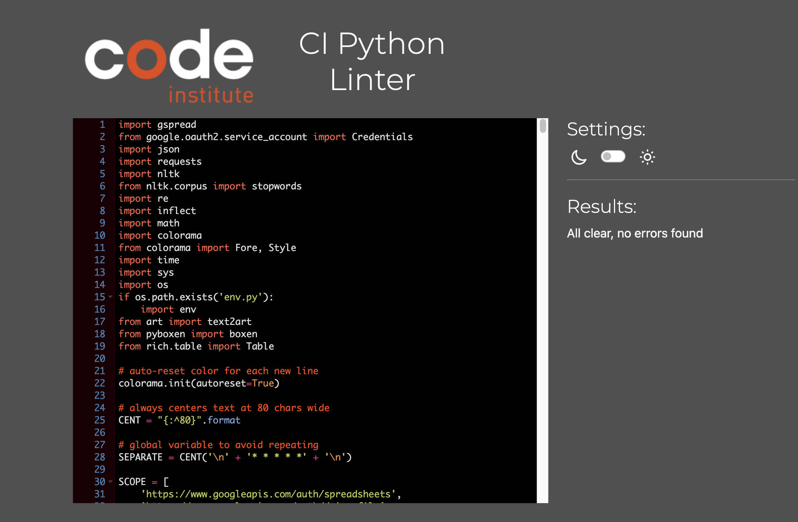 | 
xxxxxxxxx |


## Defensive Programming

Defensive programming was manually tested with the below user acceptance testing:

| Section | Expectation | Test | Result | Fix | Screenshots |
| --- | --- | --- | --- | --- | --- |
| Landing Page: feature 1 | Pressing enter starts the game | Press enter when instructed. |The Game started as expected. |No fix required.| 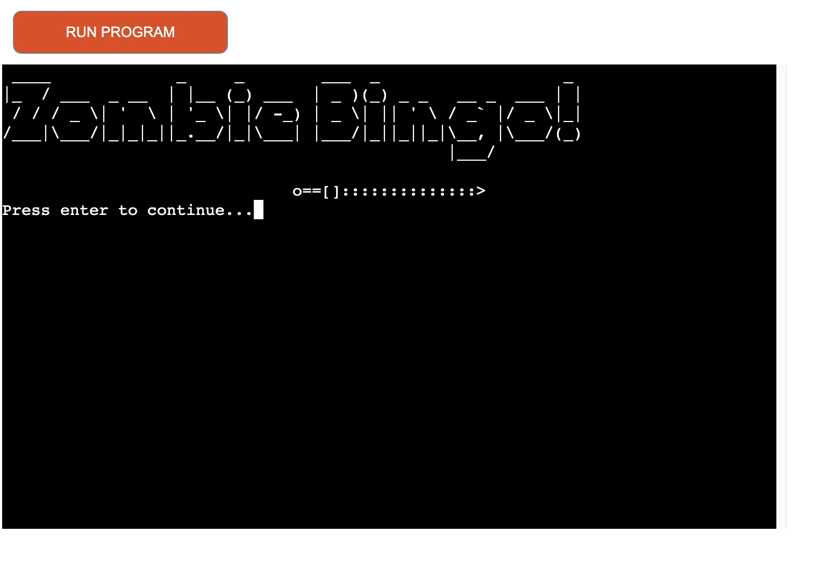 |
| Landing Page: feature 2| Ctrl C will confirm if user wants to leave the game. If not, the game will continue.| Used control C on home page.  | Program confirms y or n with user as expected. Program finishes if y inputted, program starts if n inputted. | No fix required. |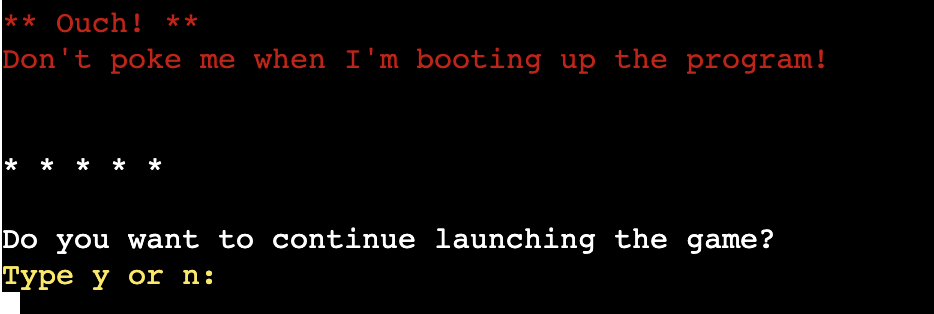 |
 | Q1: feature 3a| Will report an error to user if the answer submitted is blank.| Tested by inputting nothing before pressing enter. |Resulted in user being prompted again to submit an answer. |No fix required.| 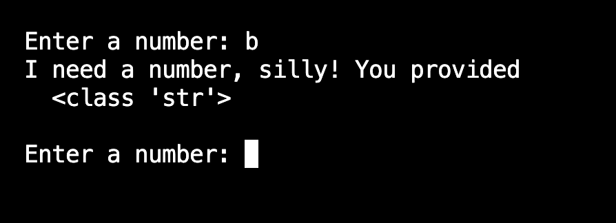 |
 | Q1: feature 3b| Only will accept number. Will prompt user to try again if not a number (for example if a letter or symbol was used). |Tested by inputting 'b' for test 1, '&' for test 2. |Resulted in error being reported to user appropriately on both counts, before asking user to try answering again. |No fix required. |  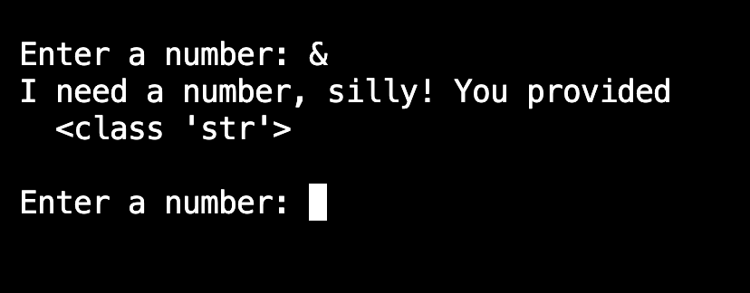 |
| Q1: feature 4| Will accept two-digit numbers as well as single digit numbers (e.g. 72 or 3).| Tested both with 2-digit and single digit numbers | Accepts numbers as expected. | No fix required|   |
| Q1: feature 5| Only will accept number between 0 and 100. Will prompt user to try again if not within range.| Tested by inputting 450. |Program noted the error in the terminal but continued.|Fixed by adding ```Return False``` to second if statement in validate_user_input1(). |  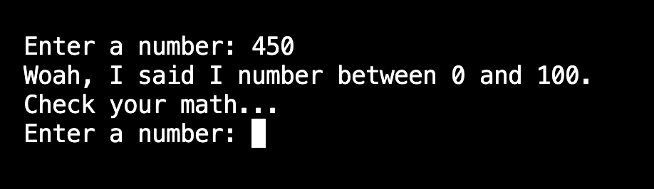|
| Q1: feature 6| If format is correct, user will receive confirmation that answer has been received and will move on to question 2.| Tested by inputting 77. |Resulted in program confirming result has received and moves on to question 2. |No fix required.| 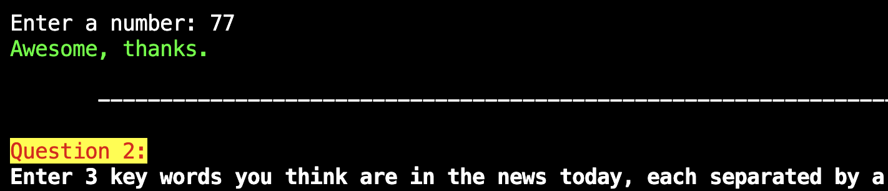 |
| Q2: feature 7| If user does not put in three words, user will be prompted again to put in three words.| Tested by inputting only two words, separated by single comma. |Resulted in reporting error to user and asks user the question again. |No fix required. | 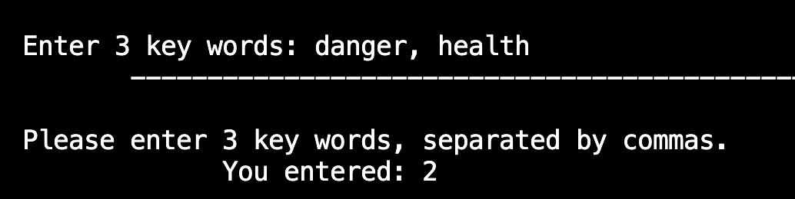 |
| Q2: feature 8| Answers must be separated by commas. If they are not separated by commas, user will be prompted again.| Tested by inputting three words without any commas.|Resulted in error being logged to user, but error message needs to be improved to emphasize the lack of commas as the issue. |Fixed by simplifying the error message which emphasizes that commas must be used. | 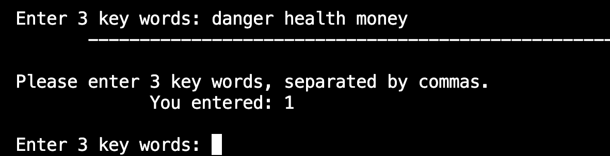 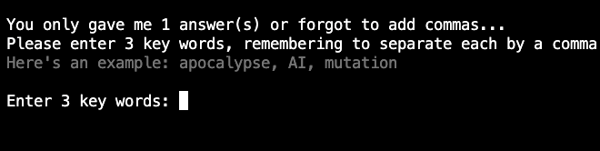 |
| Q2: feature 9 | User cannot use numbers or symbols. If user uses numbers or symbols, user will be prompted again, with incorrect answer highlighted | Tested by inputting a number in test 1, and symbols in test 2. | Both tests resulted in the same result: no errors were logged. | Fixed by ensuring ```Return False``` was in correct point in logic flow for validate_user_input2()  | 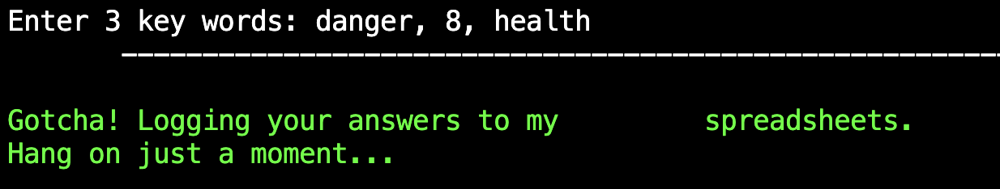 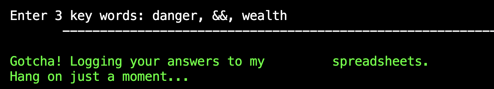 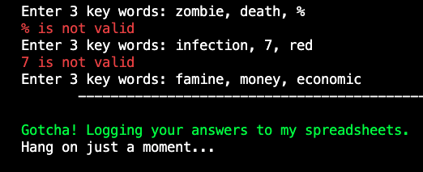|
| Q2: feature 10| If answer is in correct format, user will receive confirmation that: their answer has been logged; that their information is being logged to a spreadsheet.| Put in three words which are expected to pass validation | Validation passed and logged answers to spreadsheet with user feedback as expected.|No fix required. | 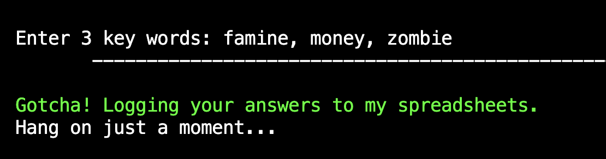 |
| End: feature 11| When user is asked 'Would you like to play again?', if 'y' is selected, the terminal will clear and the program will run again.| Typing and entering 'y' |Works as expected |No fix required. |  |
| End: feature 12| When user is asked 'Would you like to play again?', if 'n' is selected, the program will finish after printing 'thank you for playing'.| Typing and entering 'n' |Works as expected |No fix required. | 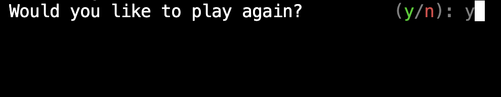 |
| End: feature 13| When user is asked 'Would you like to play again?', if the user does not press 'y' or 'n' then the program will prompt the user to type only 'y' or 'n'. | Tested by inputting 'y' and 'n' and 'h' respectively |'y' restarts the game as expected; 'n' terminates the program as expected; 'h' raises an error and prompts the user either 'y' or 'n'. |No fix required. |  |


## Bugs

- Python `E501 line too long` (93 > 79 characters)

    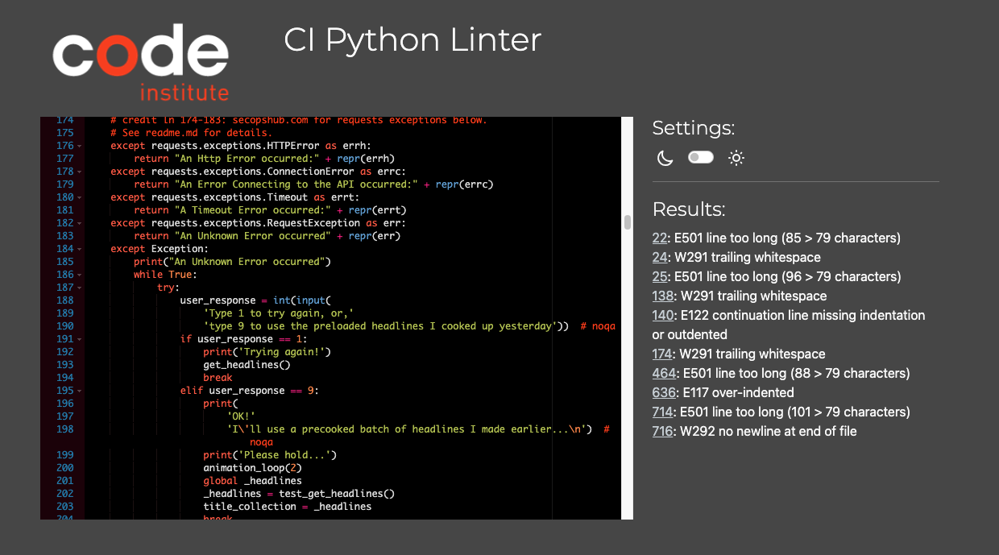

    - To fix this, I reformatted strings to multiple lines. If this was unavoidable (ie for indented code that could not be formatted on multiple lines) I added `# noqa` where absolutely unavoidable.

- Rapid API call returns None

    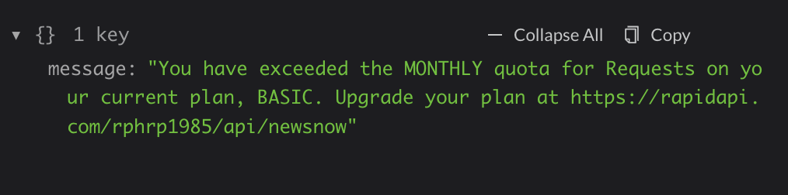
    

    - The rapid API response returns `none` if the maximum amount of calls has been reached for that month. If this happens, this has been handled by asking the user to confirm if some 'precooked' headlines should be used instead. This way the program will still run with preloaded headlines. As documented in the [README.md](README.md) file, these preloaded headlines will be updated in future versions.

## Unfixed Bugs

- When using a helper `clear()` function, any text above the height of the terminal does not clear, and remains when you scroll up.

    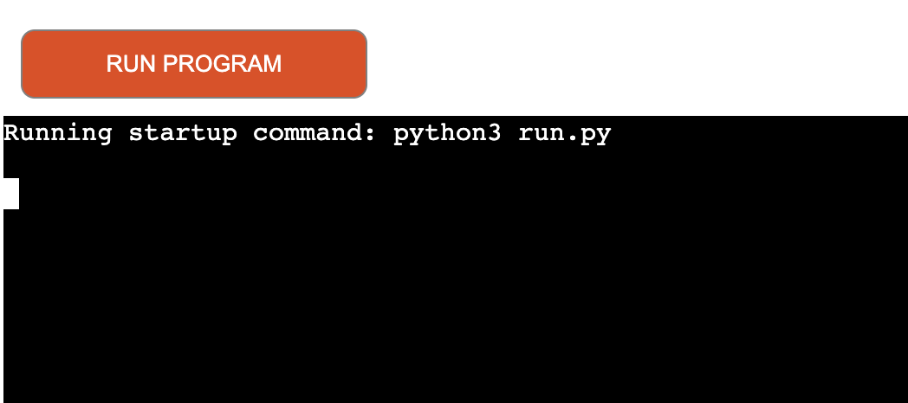
    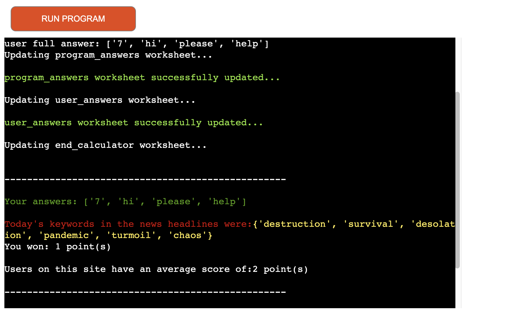

    - Attempted fix: I tried to adjust the terminal size, but it only resizes the actual terminal, not the allowable area for text. Instead I have ensured that after each user input, a clear() is used to clear the terminal as much as possible, as well as in the main() function to clear as much space as possible for the table of data displayed at the end of the game. This also applies to the very start of the program where the file name is displayed, which I tried to clear with `clear()`.

There are no remaining bugs that I am aware of.
