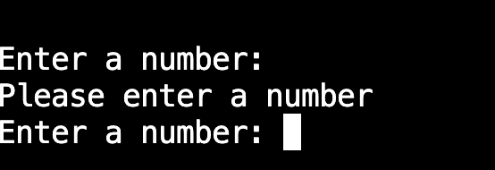
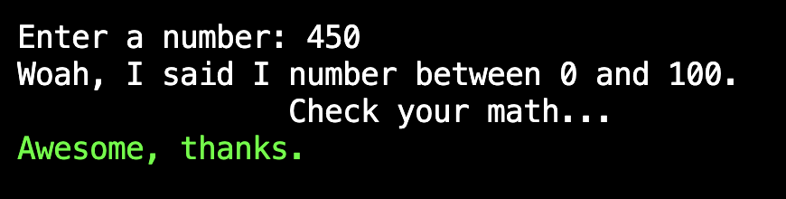

# Testing

Return back to the [README.md](README.md) file.

## Code Validation

<!-- 
It's recommended to validate each file using the API URL.
This will give you a custom URL which you can use on your testing documentation.
It makes it easier to return back to a file to validate it again in the future.
Use the steps above to generate your own custom URLs for each Python file.

**IMPORTANT**: `E501 line too long` errors

You must strive to fix any Python lines that are too long ( >80 characters ).
In rare cases where you cannot break the lines [without breaking the functionality],
then by adding `# noqa` to the end of those lines will ignore linting validation.

`# noqa` = **NO Quality Assurance**

**NOTE**: You must include 2 *spaces* before the `#`, and 1 *space* after the `#`.

Do not use `# noqa` all over your project just to clear down validation errors!
This can still cause a project to fail, for failing to fix actual PEP8 validation errors.

Sometimes strings or variables get too long, or long `if` conditional statements.
These are acceptable instances to use the `# noqa`.

When trying to fix "line too long" errors, try to avoid using `/` to split lines.
A better approach would be to use any type of opening bracket, and hit Enter just after that.

Any opening bracket type will work: `(`, `[`, `{`.

By using an opening bracket, Python knows where to appropriately indent the next line of code,
without having to "guess" yourself and attempt to tab to the correct indentation level.

-->

I have used the recommended [PEP8 CI Python Linter](https://pep8ci.herokuapp.com) to validate all of my Python files.

| File | CI URL | Screenshot | Notes |
| --- | --- | --- | --- |
| run.py | 
[PEP8 CI](https://pep8ci.herokuapp.com/https://raw.githubusercontent.com/RaymondBrien/zombie-bingo/main/run.py) |  | 
xxxxxxxxx |

<!-- Do I need to run requirements through linter? -->
<!-- ENSURE FINAL CELL FILLED OUT ONCE COMPLETE AND RUNNING NO ERRORS IN LINTER. -->


## Defensive Programming

Defensive programming was manually tested with the below user acceptance testing:

| Section | Expectation | Test | Result | Fix | Screenshots |
| --- | --- | --- | --- | --- | --- |
| Landing Page: feature 1 | Pressing enter starts the game | Press enter when instructed. |The Game started as expected. |No fix required.|  |
| Landing Page: feature 2| Ctrl C will confirm if user wants to leave the game. If not, the game will continue.| Used control C on home page.  | Program confirms y or n with user as expected. Program finishes if y inputted, program starts if n inputted. | No fix required. | |
 | Q1: feature 3a| Will report an error to user if the answer submitted is blank.| Tested by inputting nothing before pressing enter. |Resulted in user being prompted again to submit an answer. |No fix required.|  |
 | Q1: feature 3b| Only will accept number. Will prompt user to try again if not a number (for example if a letter or symbol was used). |Tested by inputting 'b' for test 1, '&' for test 2. |Resulted in error being reported to user appropriately on both counts, before asking user to try answering again. |No fix required. |   |
| Q1: feature 4| Will accept two-digit numbers as well as single digit numbers (e.g. 72 or 3).| Tested both with 2-digit and single digit numbers | Accepts numbers as expected. | No fix required|   |
| Q1: feature 5| Only will accept number between 0 and 100. Will prompt user to try again if not within range.| Tested by inputting 450. |Program noted the error in the terminal but continued.|Fixed by adding ```Return False``` to second if statement in validate_user_input1(). |  |
| Q1: feature 6| If format is correct, user will receive confirmation that answer has been received and will move on to question 2.| Tested by inputting 77. |Resulted in program confirming result has received and moves on to question 2. |No fix required.|  |
| Q2: feature 7| If user does not put in three words, user will be prompted again to put in three words.| Tested by inputting only two words, separated by single comma. |Resulted in reporting error to user and asks user the question again. |No fix required. |  |
| Q2: feature 8| Answers must be separated by commas. If they are not separated by commas, user will be prompted again.| Tested by inputting three words without any commas.|Resulted in error being logged to user, but error message needs to be improved to emphasize the lack of commas as the issue. |Fixed by simplifying the error message which emphasizes that commas must be used. |   |
| Q2: feature 9 | User cannot use numbers or symbols. If user uses numbers or symbols, user will be prompted again, with incorrect answer highlighted | Tested by inputting a number in test 1, and symbols in test 2. | Both tests resulted in the same result: no errors were logged. | Fixed by ensuring ```Return False``` was in correct point in logic flow for validate_user_input2()  |   |
| Q2: feature 10| If answer is in correct format, user will receive confirmation that: their answer has been logged; that their information is being logged to a spreadsheet.| Put in three words which are expected to pass validation | Validation passed and logged answers to spreadsheet with user feedback as expected.|No fix required. |  |
| End: feature 11| When user is asked 'Would you like to play again?', if 'y' is selected, the terminal will clear and the program will run again.| Typing and entering 'y' |Works as expected |No fix required. |  |
| End: feature 12| When user is asked 'Would you like to play again?', if 'n' is selected, the program will finish after printing 'thank you for playing'.| Typing and entering 'n' |Works as expected |No fix required. |  |
| End: feature 13| When user is asked 'Would you like to play again?', if the user does not press 'y' or 'n' then the program will prompt the user to type only 'y' or 'n'. | Tested by inputting 'y' and 'n' and 'h' respectively |'y' restarts the game as expected; 'n' terminates the program as expected; 'h' raises an error and prompts the user either 'y' or 'n'. |No fix required. |  |


## Bugs
<!-- 
This section is primarily used for JavaScript and Python applications,
but feel free to use this section to document any HTML/CSS bugs you might run into.

It's very important to document any bugs you've discovered while developing the project.
Make sure to include any necessary steps you've implemented to fix the bug(s) as well.

**PRO TIP**: screenshots of bugs are extremely helpful, and go a long way! -->


- Python `'ModuleNotFoundError'` when trying to import module from imported package

    

    - To fix this, I _____________________.


- Python `E501 line too long` (93 > 79 characters)

    

    - To fix this, I _____________________.

## Unfixed Bugs

<!-- You will need to mention unfixed bugs and why they were not fixed.
This section should include shortcomings of the frameworks or technologies used.
Although time can be a big variable to consider, paucity of time and difficulty understanding
implementation is not a valid reason to leave bugs unfixed.

If you've identified any unfixed bugs, no matter how small, be sure to list them here.
It's better to be honest and list them, because if it's not documented and an assessor finds the issue,
they need to know whether or not you're aware of them as well, and why you've not corrected/fixed them. -->


- For PP3, when using a helper `clear()` function, any text above the height of the terminal does not clear, and remains when you scroll up.

    

    - Attempted fix: I tried to adjust the terminal size, but it only resizes the actual terminal, not the allowable area for text.


There are no remaining bugs that I am aware of.
